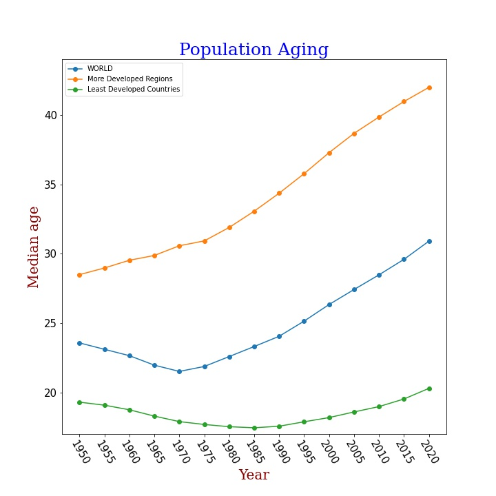

# population-aging
Visualizing population aging using 'Median Age of Population' dataset from the UN to help make an argument as to why longevity research must be supported.

In recent years, there has been an upward trend in the median age of the population in most countries due to declining fertility rates and rising life expectancy. 
The aged population is currently at its highest level in human history. The UN predicts the rate of population ageing in the twenty-first century will exceed that of the 
previous century.

Population aging arises from two effects which are increasing longevity and declining fertility. The effects are possibly related. The increasing in longevity is mostly due to 
easier access to better healthcare. Which is why, the median age of the population is higher in more developed regions as seen in the figure. As health improves, families choose 
to have lesser children, thus resulting in a decline in fertility. The decline in fertility is actually a good thing in terms of population size, but the increase in median age 
of the world population has its problems.

Lifespan vs Health Span : Former is the total number of years we live whereas the latter is how many of those years we remain healthy and free from disease.

The problem with the current scenario is that most of the elderly population is living beyond its health span, thus not enjoying the extra years of life gained from the 
technological and medical advances. An increase in poor health with increased longevity is not great.

Enter longevity research : So far, the increase in longevity has been a result of better access to healthcare rather than an intentional effort to treat aging at its source. 
Research into longevity and healthy aging has progressed rapidly in recent years. In the 20th century, the medical and pharmaceutical development has been focused on tackling 
one disease at a time. But longevity research is focused towards developing medicines and therapies that will treat aging at its source and thereby have a much greater impact on 
health and lifespan than drugs that target a single disease. That means, that an increase in lifespan will be accompanied with an increase in health span with little difference 
between them, i.e., the compression of morbidity. That means the overall health of the aged population and the healthcare costs will be improved. If that is achieved, the older 
population will not be a burden to the society.

People are investments : Every society in our world places a bet on each one of its individual citizens — chiefly through education and training — that pays off over the 
course of a taxpaying lifetime. Those investments already produce tremendous dividends to our societies — for every dollar a government spends on education, the nation's GDP 
grows on average by about $20. This is an era in which age related sickness and death rob us of years of productivity. Imagine, then, what the returns would be if we extended 
the best working years of people's lives. When we extend healthy lives, we exponentialize the investment. The longer people stay in the workforce, the better our return.

The future : Criticism is always faced by something that's transformative. It can be helpful to make possible corrections to the route. But longevity research cannot be 
entirely stopped. As we have seen, population ageing is inevitable so why not make the best of it? It is new and exciting. There is no economic model for a world in which 
people live 40 years or more past the time of traditional retirement. We literally have no idea whatsoever on the work patterns, retirement arrangements, spending habits, 
health care needs, savings and investments of large group of people who live, quite healthily, well into their 100s. It's hard to predict anything because we tend to 
extrapolate into the future directly from the way things are now. We need to account for human ingenuity. You never know what's coming up and we almost always find a way to 
deal with a problem. The future is exciting. Support longevity research.

References:
1. Lifespan: Why We Age - and Why We Don't Have To. -- Book by David Sinclair
2. https://en.wikipedia.org/wiki/Population_ageing#:~:text=Population%20ageing%20is%20a%20shift%20in%20the%20distribution,the%20proportion%20of%20the%20population%20composed%20of%20elderly.
